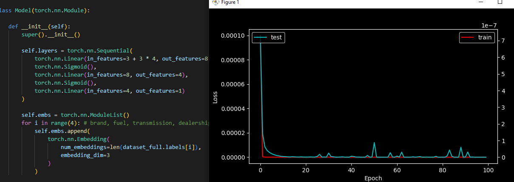
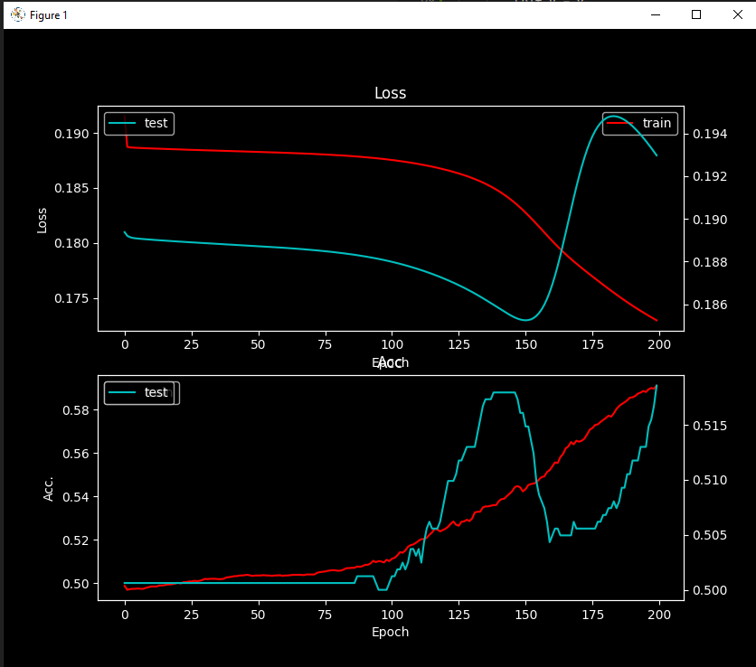

# Task 6_2: Pytorch regression
Uzdevuma jēga: Iepazīt Pytorch, Softmax

Embedded matrix:

Konceptuāli liekas ka sapratu, detaļas implementācijā nav īsti skaidras.

~~~
elf.embs = torch.nn.ModuleList()
        for i in range(4): # brand, fuel, transmission, dealership
            self.embs.append(
                torch.nn.Embedding(
                    num_embeddings=len(dataset_full.labels[i]),
                    embedding_dim=3
                )
            )

    def forward(self, x, x_classes):
        x_emb_list = []
        for i, emb in enumerate(self.embs):
            x_emb_list.append(
                emb.forward(x_classes[:, i])
            )
        x_emb = torch.cat(x_emb_list, dim=-1)
        x_cat = torch.cat([x, x_emb], dim=-1)
        y_prim = self.layers.forward(x_cat)
        return y_prim
~~~

Loss Huber:

~~~
class LossHuber(torch.nn.Module):
    def __init__(self, delta):
        super().__init__()
        self.delta = delta

    def forward(self, y_prim, y):
        return torch.mean(self.delta**2 * (torch.sqrt(1 + ((y - y_prim)/self.delta) ** 2) - 1))
~~~

Modeļa rezultāts:

)

# Task 6_3: Numpy classification

Veidojot softmax funkciju, nesanāca to patstāvīgi izdarīt.

Backward: Nesapratu else daļu - liekas ka a[:,row] * a[:, column] īsti neizpilda formulēto rezultātu?
*Baigi labs pieraksts, nebutu pats izdomājis, jo vel nedomāju tik labi par for loopiem iekš matricām.

Softmax:
~~~
class LayerSoftmax():
    def __init__(self):
        self.x = None
        self.output = None

    def forward(self, x):
        self.x = x

        np_x = np.array(x.value)
        np_x -= np.max(np_x, axis=-1, keepdims=True)
        np_e_x = np.exp(np_x)

        self.output = Variable(
            np_e_x / np.sum(np_e_x, axis=-1, keepdims=True)  # var arī [:, np.newaxis]
        )
        return self.output

    def backward(self):
        size = self.x.value.shape[-1]
        J = np.zeros((BATCH_SIZE, size, size))
        a = self.output.value
        
        for row in range(size):
            for column in range(size):
                if row == column:
                    J[:, row, column] = a[:,row] * (1 - a[:, column])
                else: 
                    J[:, row, column] = -a[:,row] * a[:, column]

        self.x.grad += np.squeeze(J @ np.expand_dims(self.output.grad, axis=-1), axis=-1)
~~~

Loss Entropy:

~~~
class LossCrossEntropy():
    def __init__(self):
        self.y_prim = None

    def forward(self, y, y_prim):
        self.y = y
        self.y_prim = y_prim
        return np.mean(-y.value * np.log(y_prim.value + 1e-8))

    def backward(self):
         self.y_prim.grad = -self.y.value / (self.y_prim.value + 1e-8)
~~~

Accuracy evaluator:

~~~
def isAccurate(y, y_prim):
    correct = 0
    for i in range(BATCH_SIZE-1):
        selectedIndex = np.where(y[i] == 1)[0][0]
        actualMaxValue = y_prim.value[i].max()
        if actualMaxValue == y_prim.value[i][selectedIndex]:
            correct += 1
    return correct/BATCH_SIZE
~~~

Result:
)