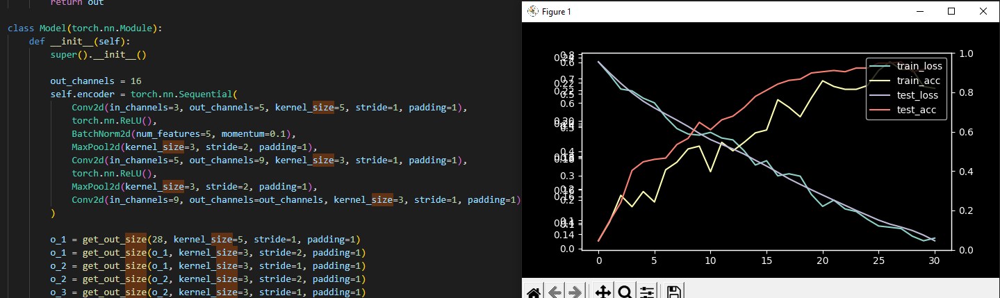

# Task 7_1: Konvolūcijas tīkla implementācija & Maxpool funkcija

Uzdevums izdevās labi, likās interesanti strādāt ar vizuālu recognition bet liekas ka implementāciju kerneliem un paddingam līdz galam neaptvēru, jo sanāca ļoti norakstīt kodu no lekcijas. 

Konceptuāli īsti nesapratu kā tas viss strādā no lekcijas tapēc paskatījos extra video no andrew ng un MIT lai labak ieietu smadzenes.

### List of implemented functions:

1. Conv2d
~~~
class Conv2d(torch.nn.Module):
    def __init__(
            self,
            in_channels,
            out_channels,
            kernel_size,
            stride,
            padding
    ):
        super().__init__()
        self.in_channels = in_channels
        self.out_channels = out_channels
        self.kernel_size = kernel_size
        self.stride = stride
        self.padding = padding

        self.K = torch.nn.Parameter(
            torch.FloatTensor(kernel_size, kernel_size, in_channels, out_channels)
        )
        torch.nn.init.kaiming_uniform_(self.K)

    def forward(self, x):
        batch_size = x.size(0)
        in_size = x.size(-1)
        out_size = get_out_size(in_size, self.padding, self.kernel_size, self.stride)

        out = torch.zeros(batch_size, self.out_channels, out_size, out_size)
        
        x_padded_size = in_size + self.padding*2
        if self.padding:
            x_padded = torch.zeros(batch_size, self.in_channels, x_padded_size, x_padded_size)
            x_padded[:, :, self.padding:-self.padding, self.padding:-self.padding] = x
        else:
            x_padded = x.to(DEVICE)

        K = self.K.view(-1, self.out_channels) # kernel_size8kernel_size*in_channels

        i_out = 0
        for i in range(0, x_padded_size-self.kernel_size+1, self.stride):
            j_out = 0
            for j in range(0, x_padded_size-self.kernel_size+1, self.stride):
                x_part = x_padded[:, :, i:i+self.kernel_size, j:j+self.kernel_size]
                x_part = x_part.reshape(batch_size, -1)

                out_part = x_part @ K # (batch, out_channels)
                out[:, :, i_out, j_out] = out_part

                j_out += 1
            i_out += 1

        return out
~~~

CPU impl:

GPU impl:

2. MaxPool2d

~~~
class MaxPool2d(torch.nn.Module):
    def __init__(
        self,
        kernel_size, 
        stride,
        padding
    ):

        super().__init__()

        self.kernel_size = kernel_size
        self.stride = stride
        self.padding = padding

    def forward(self, x):
        batch_size = x.size(0)
        channels = x.size(1)
        in_size = x.size(-1)
        out_size = get_out_size(in_size, self.padding, self.kernel_size, self.stride)

        out = torch.zeros(batch_size, channels, out_size, out_size).to(DEVICE)

        x_padded_size = in_size + self.padding * 2
        if self.padding:
            x_padded = torch.zeros(batch_size, channels, x_padded_size, x_padded_size).to(DEVICE)
            x_padded[:, :, self.padding:-self.padding, self.padding:-self.padding] = x
        else:
            x_padded = x.to(DEVICE)

        i_out = 0
        for i in range(0, x_padded_size-self.kernel_size+1, self.stride):
            j_out = 0
            for j in range(0, x_padded_size-self.kernel_size+1, self.stride):
                x_part = x_padded[:, :, i:i+self.kernel_size, j:j+self.kernel_size]
                x_part = x_part.reshape(batch_size, channels, -1)

                out_part = torch.max(x_part, dim=-1).values # x_part @ K # (batch, out_channels)
                out[:, :, i_out, j_out] = out_part
                
                j_out += 1
            i_out += 1

        return out
~~~

3. BatchNorm2d

~~~
class BatchNorm2d(torch.nn.Module):
    def __init__(
        self,
        num_features, 
        momentum
    ):
        super().__init__()

        self.num_features = num_features
        self.momentum = momentum
        self.gamma = torch.nn.Parameter(torch.ones(1, self.num_features, 1, 1))
        self.beta = torch.nn.Parameter(torch.zeros(1, self.num_features, 1, 1))

        self.moving_mean = torch.zeros(1, self.num_features, 1, 1)
        self.moving_var = torch.ones(1, self.num_features, 1, 1)

    def forward(self, x):
        if x.size(1) != self.num_features:
            raise Exception('Wrong channel count in batchnorm')    

        if self.moving_mean.device != x.device:
            self.moving_mean = self.moving_mean.to(x.device)
            self.moving_var = self.moving_var.to(x.device)

        if self.training:
            mean = x.mean(dim=(0,2,3), keepdims=True)
            var = ((x - mean)**2).mean(dim=(0,2,3), keepdims=True)

            self.moving = mean * self.momentum + self.moving_mean * (1 - self.momentum)
            self.moving_var = var * self.momentum + self.moving_var * (1 - self.momentum)
            out_norm = (x - mean) / torch.sqrt(var + 1e-5)
        else:
            out_norm = (x - self.moving_mean) / torch.sqrt(self.moving_var + 1e-5)
        out = self.gamma * out_norm + self.beta
        return out
~~~

