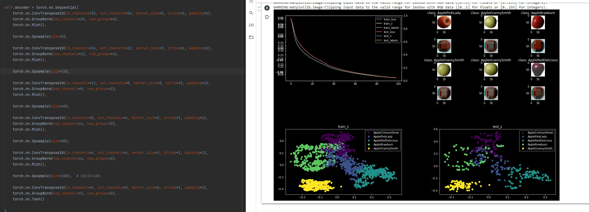

# Task 9: AE & DAE

Ļoti interesants. Saskāros ar vairākām problēmām bet visas ātrāk vai vēlāk atrisisināju(colab negāja, decoding slānis nedeva correct shape, batch size kad lietoju cpu nemaceju izmainit u.c. )

Jautājumi:
1. Kam īsti ir vajadzīgi ģeneratīvo modeļu izveidotās bildes?
2. Izveidojot algoritmu ar upsample, ģenerētās bildes izskatās sliktāk. Kāpēc tā?
3. Kāpēc mēs samazinam bildes izmeru lidz 1x1?
4. Kā pievienot bildi datusetam? kādā formātā?

Par noise:
1. Nesapratu kā adding noise tieši mums palīdz? ģenerētie rezultāti neizskatās labāk. Es lasīju ka tie palīdz, lai samazinātu overfitting un underfitting, ko tieši tas nozīmē?
2. Vai mums modeļa analīzē nevajadzētu salīdzināt uzģenerēto bildi ar bildi pirms papildu troksnis tika pielikts? Tagad sanāk ka mēs trenējam modeli ģenerēt troksni. 

1 Novērojums: Liekas ka tīrīšanas slānis īpaši neuzlabo rezultātus šajā modelī.

Ar tirisanas slāni:

Bez tīrīšanas slāņa:

### List of implemented functions:
1. Encoder

~~~
        self.encoder = torch.nn.Sequential(
            torch.nn.Conv2d(in_channels=3, out_channels=4, kernel_size=7, stride=3, padding=0),
            torch.nn.BatchNorm2d(num_features=4),
            torch.nn.LeakyReLU(),

            torch.nn.Conv2d(in_channels=4, out_channels=8, kernel_size=8, stride=4, padding=2),
            torch.nn.BatchNorm2d(num_features=8),
            torch.nn.LeakyReLU(),

            torch.nn.Conv2d(in_channels=8, out_channels=16, kernel_size=4, stride=2, padding=1),
            torch.nn.BatchNorm2d(num_features=16),
            torch.nn.LeakyReLU(),

            torch.nn.Conv2d(in_channels=16, out_channels=32, kernel_size=4, stride=2, padding=1),
            torch.nn.BatchNorm2d(num_features=32),
            torch.nn.LeakyReLU(),

            torch.nn.Conv2d(in_channels=32, out_channels=32, kernel_size=4, stride=2, padding=1),
            torch.nn.BatchNorm2d(num_features=32),
            torch.nn.Tanh()
        )
~~~

Bez īsta decodera:

2. Decoder

~~~
self.decoder = torch.nn.Sequential(
            torch.nn.ConvTranspose2d(in_channels=32, out_channels=24, kernel_size=4, stride=2, padding=1),
            torch.nn.BatchNorm2d(num_features=24),
            torch.nn.LeakyReLU(),
            
            torch.nn.ConvTranspose2d(in_channels=24, out_channels=12, kernel_size=4, stride=2, padding=1),
            torch.nn.BatchNorm2d(num_features=12),
            torch.nn.LeakyReLU(),
            
            torch.nn.ConvTranspose2d(in_channels=12, out_channels=8, kernel_size=4, stride=2, padding=1),
            torch.nn.BatchNorm2d(num_features=8),
            torch.nn.LeakyReLU(),
            
            torch.nn.ConvTranspose2d(in_channels=8, out_channels=4, kernel_size=8, stride=4, padding=2),
            torch.nn.BatchNorm2d(num_features=4),
            torch.nn.LeakyReLU(),

            torch.nn.ConvTranspose2d(in_channels=4, out_channels=4, kernel_size=7, stride=3, padding=0),
            torch.nn.BatchNorm2d(num_features=4),
            torch.nn.LeakyReLU(),

            torch.nn.ConvTranspose2d(in_channels=4, out_channels=3, kernel_size=3, stride=1, padding=1),
            torch.nn.BatchNorm2d(num_features=3),
            torch.nn.Sigmoid()
        )
~~~

Pievienojot decoder, tiek ģenerēti atkodēti attēli:

Pycharm:

Colab (var daudz vairāk epochus apmācīt):

3. Noise addition
Pirmais mēģinajums noising:

~~~
    def __getitem__(self, idx):
        x = self.X[idx] / 255
        y_label = self.Y[idx]
        dims = x.shape
        for i in range(dims[0]):
            for j in range(dims[1]):
                for k in range(dims[2]):
                    if random.randint(1, 10) < 6:
                        x[i][j][k] = 0

        return x, y_target, y_label
~~~

algoritms bija ļoti lēns.
Norakstīts no lekcijas. Nesparotu kapēc tas strādā - vai tad mēs neuzģenērjam jaun umatricu ar pilnīgi random vērībām no x paņemot tikai size?

~~~
    def applyNoise(self, x):
        if np.random.random() < 0.5:
            noise = torch.randn(x.size())
            x[noise < 0.5] = 0
~~~

4. Upscale + GroupNorm modelis:
~~~
        self.encoder = torch.nn.Sequential(
            torch.nn.Conv2d(in_channels=3, out_channels=4, kernel_size=3, stride=1, padding=1),
            torch.nn.GroupNorm(num_channels=4, num_groups=2),
            torch.nn.Mish(),
            torch.nn.Upsample(size=50),

            torch.nn.Conv2d(in_channels=4, out_channels=8, kernel_size=3, stride=1, padding=1),
            torch.nn.GroupNorm(num_channels=8, num_groups=2),
            torch.nn.Mish(),

            torch.nn.Upsample(size=10),  # 100>10

            torch.nn.Conv2d(in_channels=8, out_channels=16, kernel_size=1, stride=1, padding=1),
            torch.nn.GroupNorm(num_channels=16, num_groups=4),
            torch.nn.Mish(),

            torch.nn.Conv2d(in_channels=16, out_channels=32, kernel_size=3, stride=1, padding=1),
            torch.nn.GroupNorm(num_channels=32, num_groups=8),
            torch.nn.Mish(),

            torch.nn.Upsample(size=1),  # 10>1

            torch.nn.Conv2d(in_channels=32, out_channels=32, kernel_size=3, stride=1, padding=1),
            torch.nn.GroupNorm(num_channels=32, num_groups=8),

            torch.nn.Tanh()
        )

        self.decoder = torch.nn.Sequential(
            torch.nn.ConvTranspose2d(in_channels=32, out_channels=24, kernel_size=3, stride=1, padding=1),
            torch.nn.GroupNorm(num_channels=24, num_groups=4),
            torch.nn.Mish(),

            torch.nn.Upsample(size=5),

            torch.nn.ConvTranspose2d(in_channels=24, out_channels=12, kernel_size=3, stride=1, padding=1),
            torch.nn.GroupNorm(num_channels=12, num_groups=4),
            torch.nn.Mish(),

            torch.nn.Upsample(size=10),

            torch.nn.ConvTranspose2d(in_channels=12, out_channels=8, kernel_size=3, stride=1, padding=1),
            torch.nn.GroupNorm(num_channels=8, num_groups=2),
            torch.nn.Mish(),

            torch.nn.Upsample(size=40),

            torch.nn.ConvTranspose2d(in_channels=8, out_channels=4, kernel_size=3, stride=1, padding=1),
            torch.nn.GroupNorm(num_channels=4, num_groups=2),
            torch.nn.Mish(),

            torch.nn.Upsample(size=80),

            torch.nn.ConvTranspose2d(in_channels=4, out_channels=4, kernel_size=3, stride=1, padding=1),
            torch.nn.GroupNorm(num_channels=4, num_groups=2),
            torch.nn.Mish(),

            torch.nn.Upsample(size=100),  # 10x10>100

            torch.nn.ConvTranspose2d(in_channels=4, out_channels=3, kernel_size=3, stride=1, padding=1),
            torch.nn.GroupNorm(num_channels=3, num_groups=3),
            torch.nn.Tanh()

        )
~~~

